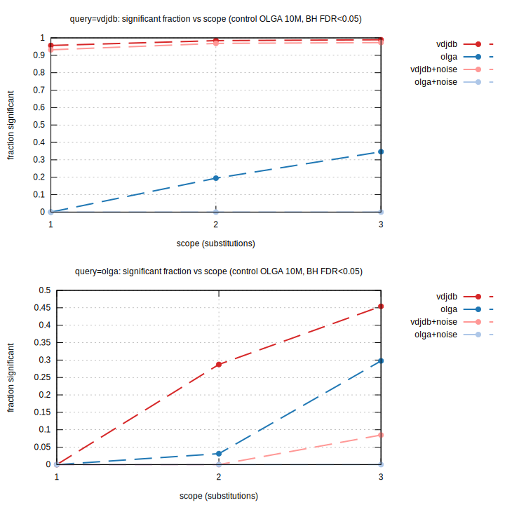
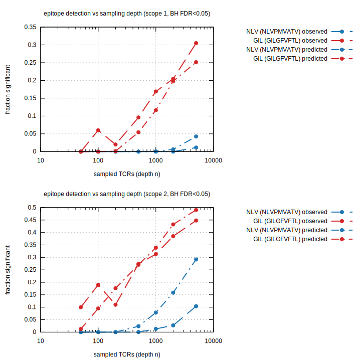
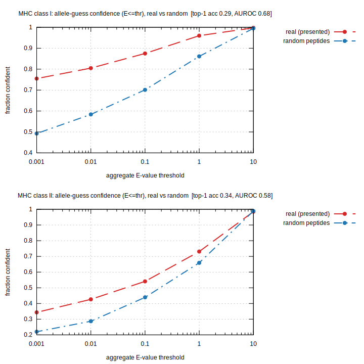

Benchmarks
==========

Several harnesses ship with the repo, covering raw throughput, recall, E-value significance, and the
epitope-detection formalism. Most bootstrap realistic TCR CDR3 sequences from OLGA (if installed) and
otherwise fall back to seeded random sequences. Figures are rendered to SVG with gnuplot.

C++ (raw throughput + scaling)
------------------------------

.. code-block:: console

   cmake -S . -B build -DSEQTREE_BENCH=ON && cmake --build build
   ./build/seqtree_bench 1000 10000 100000 1000000

Reports build time, peak RSS, single-query latency (median / p99), batch throughput, and
thread scaling, followed by a two-engine comparison and per-call alignment cost.

Python (methods + recall)
-------------------------

``bench/bench_methods.py`` compares ``seqtm`` vs ``seqtrie`` across reference sizes, edit
scopes, and budgets (edit count and BLOSUM62 score), plus alignment-fetch cost:

.. code-block:: fish

   python bench/bench_methods.py
   env RUN_BENCHMARK=1 python bench/bench_methods.py --sizes 100000 1000000

``bench/bench.py`` measures **recall** against ground truth on the AIRR VDJdb table (queries are
mutated references with known parents), with throughput and peak RSS:

.. code-block:: fish

   python bench/bench.py
   env RUN_BENCHMARK=1 python bench/bench.py --sizes 1000000 --queries 1000000 --threads 16

E-value benchmark
-----------------

``bench/bench_evalue.py`` is the **true E-value benchmark**. For a target repertoire (VDJdb,
antigen-selected) scored against the ``airr_control`` background, at each scope/budget it reports the
number of **neighbours** (distinct hits, **excluding exact/self matches** — the queries are members
of the target, so the self-match is dropped per the punctured-null lemma), the **exact** self-hits
removed, the number of **collisions** (references re-reached via a different edit path — non-zero only
for ``seqtm`` with indels), and the **fraction of neighbours called significant** both at fixed
E-value cutoffs and after a Benjamini–Hochberg FDR correction across the query family:

.. code-block:: fish

   python bench/bench_evalue.py
   env RUN_BENCHMARK=1 python bench/bench_evalue.py --target-size 200000 --control-size 2000000

The discriminating result is the contrast between query sets: antigen-selected VDJdb queries produce
orders of magnitude more neighbours and are largely significant (BH FDR < 0.05), whereas background
(control) queries produce almost none and survive no correction. The smallest resolvable E-value is
:math:`N/M`, so finer fixed cutoffs (``E < 0.01``) require a control much larger than the target (the
``RUN_BENCHMARK`` tier uses :math:`M = 2{,}000{,}000`); the BH correction is what makes the
fixed-cutoff fractions trustworthy at small control sizes.

Comprehensive matrix
~~~~~~~~~~~~~~~~~~~~~

``bench/bench_evalue_matrix.py`` sweeps the full grid — reference set
(``vdjdb`` / ``olga`` / ``vdjdb+noise`` / ``olga+noise``, all built to the same size :math:`N`),
background control (OLGA ``1M`` / ``2M`` / ``10M``), query set (``vdjdb`` / ``olga``), and scope
(1–3 substitutions) — and emits a TSV table plus ``evalue_matrix.svg``:

.. code-block:: fish

   python bench/bench_evalue_matrix.py                       # control 1M
   env RUN_BENCHMARK=1 python bench/bench_evalue_matrix.py   # controls 1M / 2M / 10M

The signal is structural: ``vdjdb`` queries against a ``vdjdb`` reference are ~0.87–0.98 significant
(BH), ``vdjdb+noise`` stays ~0.77–0.97 (real clusters survive 50 % dilution), while ``olga``,
``olga+noise``, and all cross combinations sit at ~0. The naive ``E < 1`` column over-calls (e.g.
``olga``-vs-``olga`` reads 1.0) where BH reads 0.0 — a direct demonstration that the multiple-testing
correction is what separates genuine convergence from background.

Epitope detection complexity
~~~~~~~~~~~~~~~~~~~~~~~~~~~~~~

``bench/bench_epitope.py`` tests the detectability formalism on two HLA-A*02 epitopes of opposite
repertoire structure: **GIL** (GILGFVFTL, one dominant convergent cluster) and **NLV** (NLVPMVATV,
many diverse small clusters). It reports each epitope's within-set neighbour density, degree, and
cluster sizes, then subsamples to depth :math:`n` and plots the fraction called significant (BH
FDR < 0.05) against the degree-distribution prediction of Eq. (φ) in the appendix:

.. code-block:: fish

   python bench/bench_epitope.py --scopes 1 2

At scope 1, GIL (ρ = 3.4×10⁻⁴, largest cluster 896 = 17 % of the set) is ~20–30 % recovered by
:math:`n\sim10^3` sampled TCRs, while NLV (ρ = 2.8×10⁻⁵, largest cluster 152 = 1.2 %) stays below 5 %
even at :math:`n\sim5\times10^3` — detection complexities differing by an order of magnitude purely
from repertoire structure. See ``appendix/evalue.tex`` §"Epitope detection complexity".

MHC-allele guessing
~~~~~~~~~~~~~~~~~~~~

``bench/bench_mhc_guess.py`` evaluates the reverse problem — *peptide → presenting allele* — for
class I and class II. Each held-out peptide's **presentation** (anchor) signature is widened until it
has 10–100 non-exact neighbours; the neighbours' alleles are voted, and the top allele's count is
tested against the background allele frequency to give an **aggregate E-value / confidence**:

.. code-block:: fish

   python bench/bench_mhc_guess.py --pmhc /path/to/pmhc_full.tsv.gz

On ``pmhc_data`` (alleles with ≥200 peptides) top-1 accuracy is ~0.29 for class I (129 alleles,
≈38× chance) and ~0.34 for class II; real presented peptides have a much lower aggregate E-value than
length-matched **random** peptides (≈0.18 vs 0.61 class I; AUROC ≈0.68), so random noise is rejected
by an E-value threshold. This works only with *anchor* features — TCR-facing homology carries no
allele information (AUROC ≈0.5), confirming MHC restriction lives in the anchors.

TCR-beta benchmark (gnuplot figures)
------------------------------------

``bench/bench_gnuplot.py`` is the main benchmark. It measures **two reference families separately**,
so the effect of sequence structure is visible rather than averaged away:

* **olga** — OLGA-generated human TRB CDR3 (a generative model, **no antigen motif**); queried with
  1000 fresh OLGA TRB sequences.
* **vdjdb** — VDJdb CDR3 **mutated** (real antigen-specific receptors, **with shared motif**
  structure); queried with 1000 held-out VDJdb CDR3.

Both families are expanded by substitution-mutation to each target size. Timings are over the 1000
queries. Figures are **vertically stacked two-panel SVGs**; **seqtm is drawn with a long dash and
seqtrie with a dash-dot**, and the reference family is encoded by colour.

.. code-block:: fish

   python bench/bench_gnuplot.py                       # fast tier: 10k / 100k
   env RUN_BENCHMARK=1 python bench/bench_gnuplot.py   # full tier: 10k / 100k / 1M / 10M

Each figure is written to ``bench/figures/<key>.svg`` (+ per-panel ``.tsv``). Requires ``gnuplot``
and ``olga-generate_sequences`` on PATH (``pip install olga``). The *scaling*, *matrix* and *per-op*
figures span all reference sizes; the edit-budget sweeps (*scope*, *selectivity*, *collisions*) run
at one representative size to stay tractable.

A note on engine semantics: at an edit budget *e*, **seqtm** explores the **Hamming ball**
(``max_subs=e``, substitutions only — the dominant TCR diversity/error mode) while **seqtrie**
explores the **edit-distance ball** (``max_total_edits=e``, substitutions *and* indels). They answer
subtly different questions, which shows as a higher match count for seqtrie at the same *e*.

Scaling and parallelism
~~~~~~~~~~~~~~~~~~~~~~~~~

Throughput (queries per millisecond) versus reference-set size, for both engines at 1, 4, and 8
threads (fixed scope: 2 substitutions), with the olga family on top and vdjdb below. Batches
parallelize near-linearly to 8 cores (~6.5–7×):

.. image:: _static/bench/scaling.svg
   :alt: throughput vs reference size per engine and thread count, olga and vdjdb
   :width: 80%

Edit budget
~~~~~~~~~~~

Cost (top) and selectivity (bottom) as the edit budget grows from 1 to 5. Throughput is governed by
**scope** far more than by reference-set size, and the match count grows steeply — by *e* = 5 a query
already pulls hundreds (seqtm Hamming ball) to thousands (seqtrie edit ball) of neighbours, so loose
budgets are rarely useful:

.. image:: _static/bench/scope.svg
   :alt: throughput and matches per query vs edit budget 1..5
   :width: 80%

Matrix scoring (BLOSUM62 / PAM50 / custom)
~~~~~~~~~~~~~~~~~~~~~~~~~~~~~~~~~~~~~~~~~~~~

seqtm scores substitutions through a substitution matrix, reporting the best (minimum-penalty) score
across all alignments to each reference. The **time overhead of matrix scoring is small** (within
~5–10 % of unit cost — one table lookup replaces a character compare), for both families:

.. image:: _static/bench/matrix.svg
   :alt: seqtm throughput unit vs BLOSUM62 vs PAM50, olga and vdjdb
   :width: 80%

Besides the built-in ``BLOSUM62`` and ``PAM50``, a custom matrix is supplied via
``SubstitutionMatrix.from_similarity`` (row/column order from ``seqtree.amino_acids()``).

Selectivity and collisions
~~~~~~~~~~~~~~~~~~~~~~~~~~~~

Top: matches per query versus the seqtrie ``max_penalty`` budget — PAM50 is stricter than BLOSUM62 at
equal budget. Bottom: **collisions** — how often seqtm's branch-and-bound re-reaches the *same*
reference via a *different* edit path (reported by ``Index.collisions_batch``). Substitution-only
search never collides; once indels are allowed, collisions rise with the edit budget, and the
motif-rich **vdjdb** family collides far more than **olga** because shared structure makes a
reference reachable by many distinct edit paths:

.. image:: _static/bench/selectivity_collisions.svg
   :alt: matches per query vs penalty budget, and seqtm collisions per query vs edit budget
   :width: 80%

Per-operation costs
~~~~~~~~~~~~~~~~~~~~~

Top: fetching a global-alignment CIGAR (the C++ Needleman–Wunsch in ``Index.align``) is on-demand and
about a microsecond per call, roughly flat in reference count. Bottom: peak resident memory after the
index build, which scales with the reference count (the trie is shared by both engines):

.. image:: _static/bench/perop.svg
   :alt: align CIGAR fetch cost and peak RSS vs reference size
   :width: 80%

Indicative numbers
~~~~~~~~~~~~~~~~~~~

Apple M3, OLGA TRB references, 1000 queries, 8 threads (``bench/bench_gnuplot.py``, full tier):

.. list-table::
   :header-rows: 1

   * - metric
     - 10k
     - 100k
     - 1M
     - 10M
   * - seqtm, 2 subs (q/ms)
     - ~271
     - ~48
     - ~8.6
     - ~2.4
   * - seqtrie, edits≤2 (q/ms)
     - ~55
     - ~11
     - ~1.2
     - ~0.28
   * - align CIGAR fetch (µs)
     - ~0.9
     - ~1.1
     - ~1.1
     - ~1.8
   * - peak RSS (MB)
     - ~91
     - ~183
     - ~990
     - ~3170

The 8-thread speed-up is ~6.5–7×; matrix scoring stays within ~5–10 % of unit cost across all sizes.

Takeaway
~~~~~~~~

Throughput is governed by **scope** (edit budget) far more than reference-set size, parallelizes
near-linearly to 8 cores, and matrix scoring is nearly free. Sequence structure matters: the
motif-rich vdjdb family is denser and collides more under indels — enumeration cost ultimately
depends on reference redundancy (see :doc:`roadmap`).
