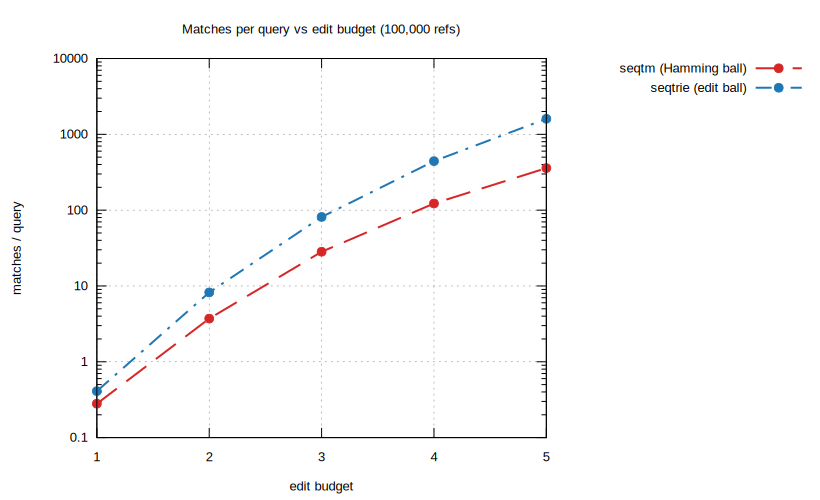
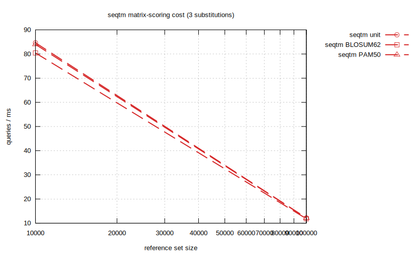
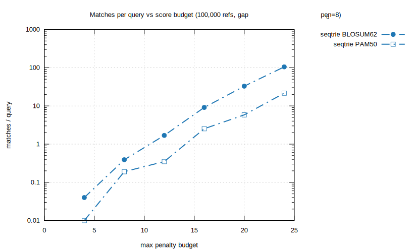
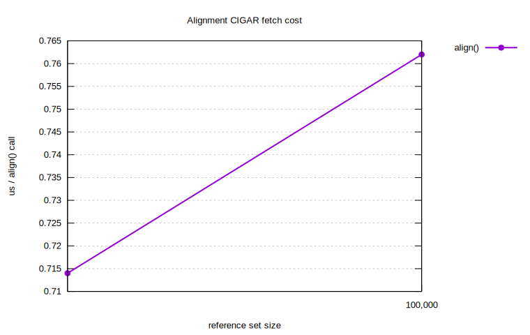
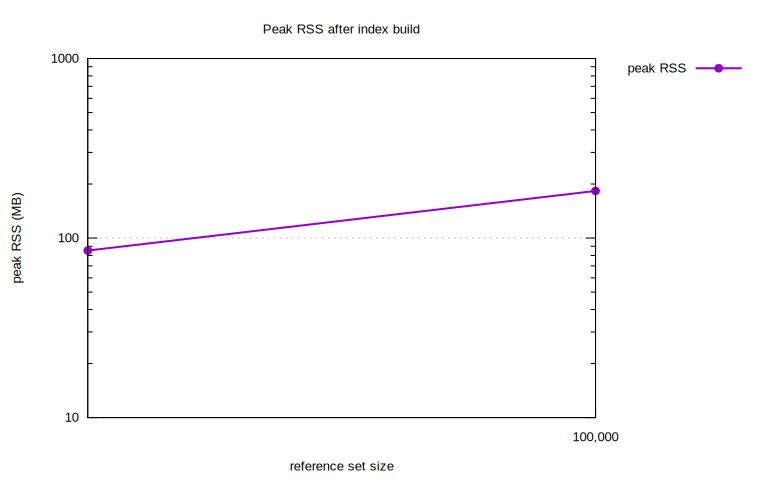

Benchmarks
==========

Two harnesses ship with the repo. Both can bootstrap realistic TCR CDR3 sequences from OLGA
(if installed) and otherwise fall back to seeded random sequences.

C++ (raw throughput + scaling)
------------------------------

.. code-block:: console

   cmake -S . -B build -DSEQTREE_BENCH=ON && cmake --build build
   ./build/seqtree_bench 1000 10000 100000 1000000

Reports build time, peak RSS, single-query latency (median / p99), batch throughput, and
thread scaling, followed by a two-engine comparison and per-call alignment cost.

Python (methods + recall)
-------------------------

``bench/bench_methods.py`` compares ``seqtm`` vs ``seqtrie`` across reference sizes, edit
scopes, and budgets (edit count and BLOSUM62 score), plus alignment-fetch cost:

.. code-block:: fish

   python bench/bench_methods.py
   env RUN_BENCHMARK=1 python bench/bench_methods.py --sizes 100000 1000000

``bench/bench.py`` measures **recall** against ground truth on the AIRR VDJdb table (queries are
mutated references with known parents), with throughput and peak RSS:

.. code-block:: fish

   python bench/bench.py
   env RUN_BENCHMARK=1 python bench/bench.py --sizes 1000000 --queries 1000000 --threads 16

TCR-beta benchmark (gnuplot figures)
------------------------------------

``bench/bench_gnuplot.py`` is the main benchmark. References are **OLGA-generated human TRB CDR3**
(amino acid) mixed with **mutated VDJdb CDR3**; queries are **1000 fresh OLGA TRB** sequences, and
all timings are taken over those 1000 queries. It renders seven single-purpose SVG figures with
gnuplot; in every figure **seqtm is drawn with a long dash and seqtrie with a dash-dot** line.

.. code-block:: fish

   python bench/bench_gnuplot.py                       # fast tier: 10k / 100k, seconds-minutes
   env RUN_BENCHMARK=1 python bench/bench_gnuplot.py   # full tier: 10k / 100k / 1M / 10M

Each figure is written to ``bench/figures/<key>.svg`` alongside the ``<key>.tsv`` it was drawn from.
Requires ``gnuplot`` and ``olga-generate_sequences`` on PATH (``pip install olga``).

A note on engine semantics: at an edit budget *e*, **seqtm** explores the **Hamming ball**
(``max_subs=e``, substitutions only — the dominant TCR diversity/error mode) while **seqtrie**
explores the **edit-distance ball** (``max_total_edits=e``, substitutions *and* indels). They
therefore answer subtly different questions, which is visible as a higher match count for seqtrie at
the same *e*.

Scaling and parallelism
~~~~~~~~~~~~~~~~~~~~~~~~~

Throughput (queries per millisecond) versus reference-set size, for both engines at 1, 4, and 8
threads (fixed scope: 2 substitutions). Batches parallelize near-linearly to 8 cores (~6.5–7×):

.. image:: _static/bench/scaling.svg
   :alt: throughput vs reference size, per engine and thread count
   :width: 100%

Edit budget
~~~~~~~~~~~

Cost and selectivity as the edit budget grows from 1 to 5. Throughput is governed by **scope** far
more than by reference-set size, and the match count grows steeply — by *e* = 5 a CDR3 query already
pulls hundreds (seqtm) to thousands (seqtrie) of neighbours, so loose budgets are rarely useful:

.. image:: _static/bench/scope.svg
   :alt: throughput vs edit budget 1..5
   :width: 49%

Matrix scoring (BLOSUM62 / PAM50 / custom)
~~~~~~~~~~~~~~~~~~~~~~~~~~~~~~~~~~~~~~~~~~~~

seqtm can score substitutions through a substitution matrix, reporting the best (minimum-penalty)
score across all alignments to each reference. The **time overhead of matrix scoring is small**
(within ~5 % of unit cost — one table lookup replaces a character compare). seqtrie selectivity is
tuned by the ``max_penalty`` budget; PAM50 is stricter than BLOSUM62 at equal budget. Besides the
built-in ``BLOSUM62`` and ``PAM50``, a custom matrix can be supplied via
``SubstitutionMatrix.from_similarity`` (row/column order from ``seqtree.amino_acids()``):

Per-operation costs
~~~~~~~~~~~~~~~~~~~~~

Fetching a global-alignment CIGAR (the C++ Needleman–Wunsch in ``Index.align``) is on-demand and
about a microsecond per call, roughly flat in reference count. Peak resident memory after the index
build scales with the reference count (the trie is shared by both engines):

Indicative numbers
~~~~~~~~~~~~~~~~~~~

Apple M3, OLGA TRB + mutated VDJdb references, 1000 OLGA TRB queries (``bench/bench_gnuplot.py``):

.. list-table::
   :header-rows: 1

   * - metric
     - 10k refs
     - 100k refs
     - notes
   * - seqtm, 2 subs, 8 threads
     - ~266 q/ms
     - ~48 q/ms
     - Hamming ball
   * - seqtrie, edits≤2, 8 threads
     - ~53 q/ms
     - ~9 q/ms
     - edit-distance ball
   * - seqtm 8-thread speed-up
     - ~6.9×
     - ~7.1×
     - vs 1 thread
   * - matrix-scoring overhead
     - <5 %
     - <5 %
     - PAM50/BLOSUM62 vs unit
   * - align CIGAR fetch
     - ~1.0 µs
     - ~1.0 µs
     - C++ NW, per call
   * - peak RSS
     - ~95 MB
     - ~185 MB
     - shared trie, well under 32 GB

Takeaway
~~~~~~~~

Throughput is governed by **scope** (edit budget) far more than reference-set size, parallelizes
near-linearly to 8 cores, and matrix scoring is nearly free; enumeration cost ultimately depends on
reference redundancy — see :doc:`roadmap` for the per-domain consequences.
