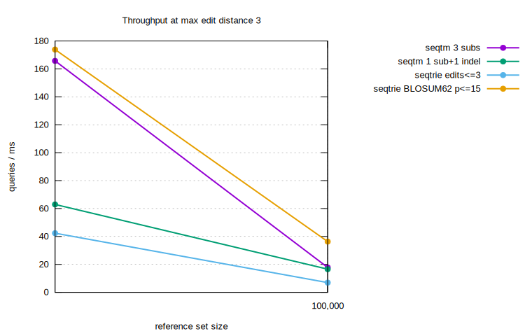

Benchmarks
==========

Two harnesses ship with the repo. Both can bootstrap realistic TCR CDR3 sequences from OLGA
(if installed) and otherwise fall back to seeded random sequences.

C++ (raw throughput + scaling)
------------------------------

.. code-block:: console

   cmake -S . -B build -DSEQTREE_BENCH=ON && cmake --build build
   ./build/seqtree_bench 1000 10000 100000 1000000

Reports build time, peak RSS, single-query latency (median / p99), batch throughput, and
thread scaling, followed by a two-engine comparison and per-call alignment cost.

Python (methods + recall)
-------------------------

``bench/bench_methods.py`` compares ``seqtm`` vs ``seqtrie`` across reference sizes, edit
scopes, and budgets (edit count and BLOSUM62 score), plus alignment-fetch cost:

.. code-block:: fish

   python bench/bench_methods.py
   env RUN_BENCHMARK=1 python bench/bench_methods.py --sizes 100000 1000000

``bench/bench.py`` measures **recall** against ground truth on the AIRR VDJdb table (queries are
mutated references with known parents), with throughput and peak RSS:

.. code-block:: fish

   python bench/bench.py
   env RUN_BENCHMARK=1 python bench/bench.py --sizes 1000000 --queries 1000000 --threads 16

Max-edit-3 throughput (gnuplot figures)
---------------------------------------

``bench/bench_gnuplot.py`` runs a deliberately simple workload — queries are references mutated by
**up to 3 edits** — and renders SVG figures with gnuplot. Throughput is reported as **queries per
millisecond** against reference sets of increasing size, for four matched configurations:

* ``seqtm 3 subs`` — ``max_subs=3`` (Hamming-style, no indels)
* ``seqtm 1 sub+1 indel`` — ``max_subs=1, max_ins=1, max_dels=1``
* ``seqtrie edits<=3`` — ``max_total_edits=3`` (banded DP)
* ``seqtrie BLOSUM62 p<=15`` — ``max_penalty=15`` (~3 conservative substitutions)

.. code-block:: fish

   python bench/bench_gnuplot.py                       # fast tier (small sizes, seconds)
   env RUN_BENCHMARK=1 python bench/bench_gnuplot.py   # full tier: 100k / 1M / 10M, 1M queries

Each figure is written to ``bench/figures/<key>.svg`` alongside the ``.tsv`` it was drawn from.
``--random`` skips the (cached) HuggingFace CDR3 fetch and uses seeded random sequences — note that
indel-heavy scopes are far slower on uniform-random sets than on real, clustered repertoires, because
a low-redundancy trie has no shared prefixes to prune (see :doc:`roadmap`).

Peak resident memory after the index build scales with the reference count (the trie is shared by
both engines):

.. image:: _static/bench/ram.svg
   :alt: peak RSS after index build vs reference-set size
   :width: 70%

Fetching an alignment CIGAR is on-demand and sub-microsecond per call, roughly flat in reference
count:

.. image:: _static/bench/align_fetch.svg
   :alt: microseconds per align() CIGAR fetch vs reference-set size
   :width: 70%

Indicative numbers
-------------------

On an Apple M3, real VDJdb CDR3 (aa) references, queries mutated by up to 3 edits
(``bench/bench_gnuplot.py``, all cores):

.. list-table::
   :header-rows: 1

   * - config
     - 10k refs
     - 100k refs
     - notes
   * - seqtm 3 subs
     - ~160 q/ms
     - ~16 q/ms
     - Hamming-style, no indels
   * - seqtm 1 sub+1 indel
     - ~63 q/ms
     - ~17 q/ms
     - branch-and-bound with indels
   * - seqtrie edits<=3
     - ~43 q/ms
     - ~7 q/ms
     - banded DP, larger constant
   * - seqtrie BLOSUM62 p<=15
     - ~177 q/ms
     - ~36 q/ms
     - matrix-weighted budget
   * - align CIGAR fetch
     - ~0.7 µs
     - ~0.7 µs
     - per call, on demand
   * - peak RSS
     - ~90 MB
     - ~185 MB
     - shared trie, well under 32 GB

Throughput is governed by **scope** (edit budget) far more than reference-set size, and enumeration
cost depends on reference redundancy — see :doc:`roadmap` for the per-domain consequences.

Single-substitution scaling
----------------------------

On an Apple M3 (16 cores), 1M amino-acid references, single-substitution queries:

.. list-table::
   :header-rows: 1

   * - metric
     - seqtm
     - seqtrie
     - notes
   * - build (1M)
     - ~0.8 s
     - ~0.8 s
     - shared trie
   * - peak RSS
     - ~1.5 GB
     - ~1.5 GB
     - well under 32 GB
   * - throughput
     - ~0.5 M q/s
     - ~0.1 M q/s
     - 16 threads, k=1
   * - alignment
     - ~0.3 µs
     - n/a
     - per call, on demand

``seqtm`` is markedly faster at small edit distances; ``seqtrie`` is the choice for
matrix-weighted budgets. Numbers vary with sequence length, scope, and hit density.
